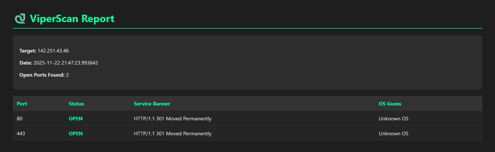

# 🐍 ViperScan

**ViperScan** is a multi-threaded network reconnaissance tool designed for security professionals and CTF players. It automates port scanning, service fingerprinting, and OS detection, presenting results in a modern HTML dashboard.



## 🚀 Features

* **High-Speed Scanning:** Utilizes `concurrent.futures` for multi-threaded execution, significantly faster than sequential scanning.
* **Service Fingerprinting:** Automatically grabs banners (HTTP, SSH, FTP) to identify running services.
* **Intelligent Reporting:** Generates a dark-mode **HTML Dashboard** for easy analysis.
* **Colorized CLI:** Clear, color-coded terminal output for real-time feedback.
* **OS Heuristics:** Analyzes banners to estimate the target Operating System.

## 🛠️ Installation

1.  **Clone the repository:**
    ```bash
    git clone https://github.com/dhy4n-117/ViperScan.git
    cd ViperScan
    ```

2.  **Install dependencies:**
    ```bash
    pip install -r requirements.txt
    ```

## 💻 Usage

**Basic Scan:**
```bash
python main.py -t google.com
```

Advanced Scan: Scans ports 1-500 with 50 threads and saves an HTML report.
```bash
python main.py -t 192.168.1.105 -p 1-500 --threads 50 -o scan_results.html
```

## 📂 Project Structure
```text
ViperScan/
├── core/
│   ├── scanner.py      # Multi-threaded scanning logic
│   └── grabber.py      # Socket-based banner grabbing
├── utils/
│   ├── reporter.py     # HTML/JSON report generator
│   └── colors.py       # Terminal UI styling
└── main.py             # CLI Entry point
```
## ⚠️ Disclaimer
 This tool is for educational purposes and authorized security testing only. Scanning networks without permission is illegal.
 
